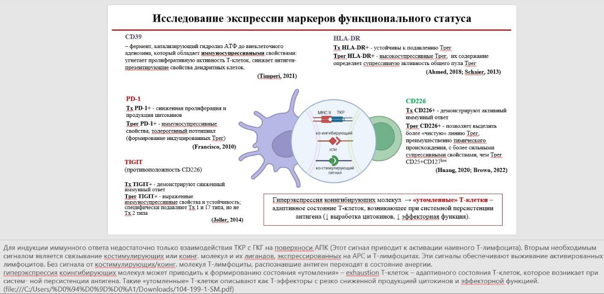

# GVHD_project

*Проект*: Исследование предиктивной способности иммунологического статуса и особенностей кластеризации на развитие хронической реакции «трансплантат против хозяина» (хРТПХ) после трансплантации аллогенных гемопоэтических стволовых клеток (ТГСК).

*Описание проекта*: Хроническая реакция «трансплантат против хозяина» (хРТПХ) является одним из наиболее частых и серьёзных осложнений после трансплантации аллогенных гемопоэтических стволовых клеток. Это состояние развивается у 50-80% пациентов и связано с иммунной дисрегуляцией, что делает изучение иммунологического статуса пациентов ключевым для понимания механизмов развития хРТПХ. В данном проекте мы исследуем предиктивную способность иммунологических параметров и особенностей кластеризации иммунных клеток для прогнозирования развития хРТПХ.

Проект выполняется командой 6 программы "Биостатистика" 2024/25 года Института Биоинформатики.

## Проект выполнили:

1. **Дмитрий Белоусов**  
   - Вклад в проект: Разведочный анализ данных, кластеризация, NMF, PERMANOVA  
   - Email: dmbelousov1806@gmail.com

2. **Наталья Ласкина**  
   - Вклад в проект: Разведочный анализ данных, логистическая регрессия, Lasso  
   - Email: lask.natalia@gmail.com

3. **Елена Марочкина**  
   - Вклад в проект: Разведочный анализ данных, кластеризация, RFS, Boruta  
   - Email: marochkina.lena@gmail.com

4. **Сергей Смирнов**  
   - Вклад в проект: Разведочный анализ данных, регрессия Кокса  
   - Email: sergeysmirnov11111@gmail.com

## Теоретические основы

### Этапы трансплантации костного мозга:
1. **Кондиционирование (химиотерапия)**: Подготовка пациента к трансплантации, включающая уничтожение собственного костного мозга и подавление иммунной системы.
2. **Трансплантация**: Введение донорских гемопоэтических стволовых клеток пациенту.
3. **Приживление**: Восстановление кроветворной и иммунной системы за счёт донорских клеток.

### Варианты дальнейшего развития событий:
- **Излечение**: Иммунная система восстанавливается быстрее, чем развивается опухоль.
- **Возврат опухоли**: Иммунная система восстанавливается медленнее, чем развивается опухоль.
- **Реакция «трансплантат против хозяина» (РТПХ)**: Дисрегуляция иммунной системы, приводящая к атаке донорских иммунных клеток на ткани реципиента.

### Патогенез хронической РТПХ:
1. **Повреждение и воспаление тканей**: Возникает из-за кондиционирования и острой РТПХ.
2. **Нарушение регуляции иммунного ответа**: Нарушение центральной и периферической толерантности, что приводит к аутоиммунным реакциям.
3. **Аберрантное восстановление тканей**: Развитие фиброза и других патологических изменений в тканях.

### Проблемы:
- 75% пациентов с хронической РТПХ нуждаются в системной иммуносупрессивной терапии, включая стероиды.
- 50% пациентов устойчивы к стероидной терапии.
- 30% пациентов приобретают зависимость от стероидной иммуносупрессивной терапии.
- Клинические фенотипы заболевания сильно различаются, но подходы к лечению остаются стандартизированными.

## Исследование экспрессии маркеров функционального статуса

### CD39
CD39 (эктонуклеозидтрифосфатдифосфогидролаза-1) — фермент, катализирующий гидролиз АТФ до аденозина, который обладает иммуносупрессивными свойствами. CD39 угнетает пролиферативную активность Т-клеток и снижает антиген-презентирующие свойства дендритных клеток. При воспалительных состояниях концентрация внеклеточного АТФ повышается, что усиливает роль CD39 в регуляции иммунного ответа.

### HLA-DR
Т-хелперы (Тх), экспрессирующие HLA-DR, устойчивы к подавлению Т-регуляторными клетками (Трег) и продуцируют более высокие уровни цитокинов. Трег, экспрессирующие HLA-DR, обладают выраженными иммуносупрессивными свойствами и определяют супрессивную активность общего пула Трег.

### PD-1
Тх, экспрессирующие PD-1, характеризуются сниженной пролиферацией и продукцией цитокинов. Трег, экспрессирующие PD-1, обладают выраженными иммуносупрессивными свойствами и толерогенным потенциалом, способствуя формированию индуцированных Трег из нерегуляторных популяций Тх.

### TIGIT
Тх, экспрессирующие TIGIT, демонстрируют сниженный иммунный ответ. Трег TIGIT+ обладают выраженными иммуносупрессивными свойствами и специфически подавляют Тх 1-го и 17-го типа, но не Тх 2-го типа.

### CD226
Тх, экспрессирующие CD226, демонстрируют активный иммунный ответ. Экспрессия CD226 на Трег позволяет выделить более «чистую» линию Трег с более сильными супрессивными свойствами.

## Начальное чтение:
- [Current Concepts and Advances in Graft-Versus-Host Disease Immunology](https://www.ncbi.nlm.nih.gov/pmc/articles/PMC8085043/)

## Изображение исследования экспрессии маркеров функционального статуса

## Литература
- Ahmed, A., et al. (2018). Circulating HLA-DR+CD4+ effector memory T cells resistant to CCR5 and PD-L1 mediated suppression compromise regulatory T cell function in tuberculosis. *PLoS Pathogens*.
- Brown, M. E., et al. (2022). Human CD4+CD25+CD226- Tregs Demonstrate Increased Purity, Lineage Stability, and Suppressive Capacity Versus CD4+CD25+CD127lo/- Tregs for Adoptive Cell Therapy. *Frontiers in Immunology*.
- Francisco, L. M., et al. (2010). The PD-1 Pathway in Tolerance and Autoimmunity. *Immunological Reviews*.
- Joller, N., et al. (2014). Treg cells expressing the coinhibitory molecule TIGIT selectively inhibit proinflammatory Th1 and Th17 cell responses. *Immunity*.
- Timperi, E., & Barnaba, V. (2021). CD39 Regulation and Functions in T Cells. *International Journal of Molecular Sciences*.
