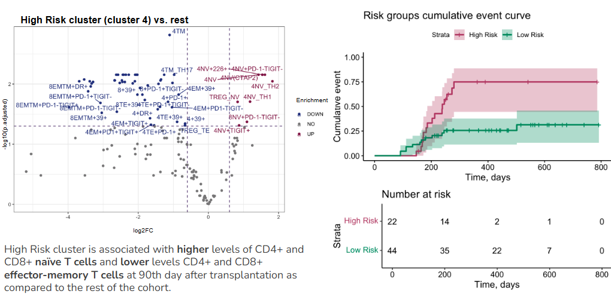
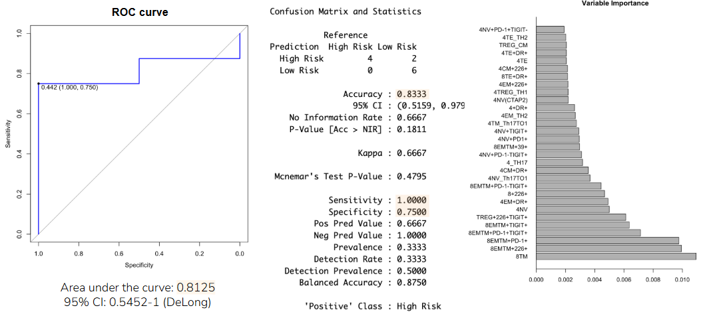
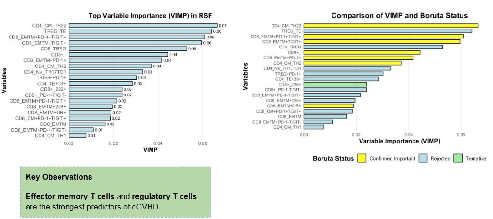
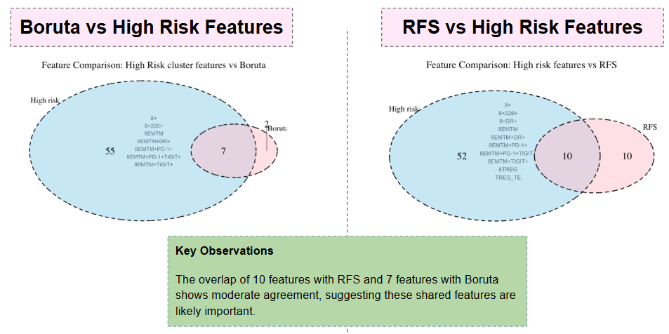

# GVHD_project

*Project*: Evaluation of the predictive ability of Immunological status and clustering patterns for Chronic Graft-Versus-Host Disease following Allogeneic Hematopoietic Stem Cell Transplantation.

*Project description*: Chronic graft-versus-host reaction (hGVHD) is one of the most frequent and serious complications after allogeneic hematopoietic stem cell transplantation. This condition develops in 50-80% of patients and is associated with immune dysregulation, making the study of the immunologic status of patients key to understanding the mechanisms of HSCT development. In this project, we investigate the prognostic ability of immunological parameters and immune cell clustering features to predict the development of CRPC.

The project is carried out by team 6 of the 2024/25 Biostatistics program of the Institute of Bioinformatics.

## Project was completed by:

1. **Dmitri Belousov**  
   - Contributions to the project: Exploratory data analysis, clustering, NMF, PERMANOVA.  
   - Email: dmbelousov1806@gmail.com

2. **Natalya Laskina**  
   - Project contribution: Exploratory data analysis, logistic regression, Lasso.  
   - Email: lask.natalia@gmail.com

3. **Elena Marochkina**  
   - Contribution to the project: Exploratory data analysis, clustering, RFS, Boruta. 
   - Email: marochkina.lena@gmail.com

4. **Sergey Smirnov**  
   - Contribution to the project: Exploratory data analysis, Cox regression.  
   - Email: sergeysmirnov11111@gmail.com

## Theoretical background

### Stages of bone marrow transplantation:
1. **Conditioning (chemotherapy)**: Preparation of the patient for transplantation, involving destruction of the patient's own bone marrow and suppression of the immune system.
2. **Transplantation**: The administration of donor hematopoietic stem cells to a patient.
3. **Transplant**: Restoration of the hematopoietic and immune system using donor cells.

### Options for further developments:
- **Cure**: The immune system recovers faster than the tumor develops.
- **Tumor recurrence**: The immune system recovers more slowly than the tumor develops.
- **Graft versus host reaction (GVR) **: Dysregulation of the immune system resulting in the attack of donor immune cells on recipient tissue.

### Pathogenesis of chronic RTPX:
1. **Tissue damage and inflammation**: Occur as a result of conditioning and acute RTPX.
2. **Disruption of immune response regulation**: Disruption of central and peripheral tolerance leading to autoimmune reactions.
3. **Dysregulated tissue repair**: Development of fibrosis and other pathologic changes in tissues.
### Problems:
- 75% of patients with chronic RTPX require systemic immunosuppressive therapy, including steroids.
- 50% of patients are resistant to steroid therapy.
- 30% of patients become dependent on steroid immunosuppressive therapy.
- Clinical phenotypes of the disease vary widely, but treatment approaches remain standardized.

### Functional status marker expression study

### CD39
CD39 (ectonucleoside triphosphate diphosphohydrolase-1) is an enzyme that catalyzes the hydrolysis of ATP to adenosine, which has immunosuppressive properties. CD39 inhibits the proliferative activity of T cells and reduces antigen-presenting properties of dendritic cells. In inflammatory conditions, the concentration of extracellular ATP is increased, which enhances the role of CD39 in the regulation of the immune response.

### HLA-DR
T-helper cells (Tx) expressing HLA-DR are resistant to suppression by T-regulatory cells (Treg) and produce higher levels of cytokines. Tregs expressing HLA-DR have marked immunosuppressive properties and determine the suppressive activity of the total Treg pool.

### PD-1
Tregs expressing PD-1 are characterized by reduced proliferation and cytokine production. PD-1-expressing Tregs have marked immunosuppressive properties and tolerogenic potential, promoting the formation of induced Tregs from non-regulatory Tx populations.

### TIGIT
Tx expressing TIGIT exhibit a reduced immune response. TIGIT+ Tregs have marked immunosuppressive properties and specifically suppress type 1 and 17 Tx, but not type 2 Tx.

### CD226
Tx expressing CD226 exhibit an active immune response. Expression of CD226 on Tregs allows isolation of a more “pure” Treg lineage with stronger suppressive properties.

## Initial reading:
- [Current Concepts and Advances in Graft-Versus-Host Disease Immunology](https://www.ncbi.nlm.nih.gov/pmc/articles/PMC8085043/)

## Imaging of functional status marker expression studies

## Results

- Stable clusters associated with cGVHD based on cell population compositions were identified and analysed;
- High cGVHD Risk cluster was shown to be associated with naive T cells populations enrichment and lower counts of effector memory compartment;
- BORUTA and RFS confirm effector memory T cells to be strong predictors of cGVHD;

## Literature
- Ahmed, A., et al. (2018). Circulating HLA-DR+CD4+ effector memory T cells resistant to CCR5 and PD-L1 mediated suppression compromise regulatory T cell function in tuberculosis. *PLoS Pathogens*.
- Brown, M. E., et al. (2022). Human CD4+CD25+CD226- Tregs Demonstrate Increased Purity, Lineage Stability, and Suppressive Capacity Versus CD4+CD25+CD127lo/- Tregs for Adoptive Cell Therapy. *Frontiers in Immunology*.
- Francisco, L. M., et al. (2010). The PD-1 Pathway in Tolerance and Autoimmunity. *Immunological Reviews*.
- Joller, N., et al. (2014). Treg cells expressing the coinhibitory molecule TIGIT selectively inhibit proinflammatory Th1 and Th17 cell responses. *Immunity*.
- Timperi, E., & Barnaba, V. (2021). CD39 Regulation and Functions in T Cells. *International Journal of Molecular Sciences*.
